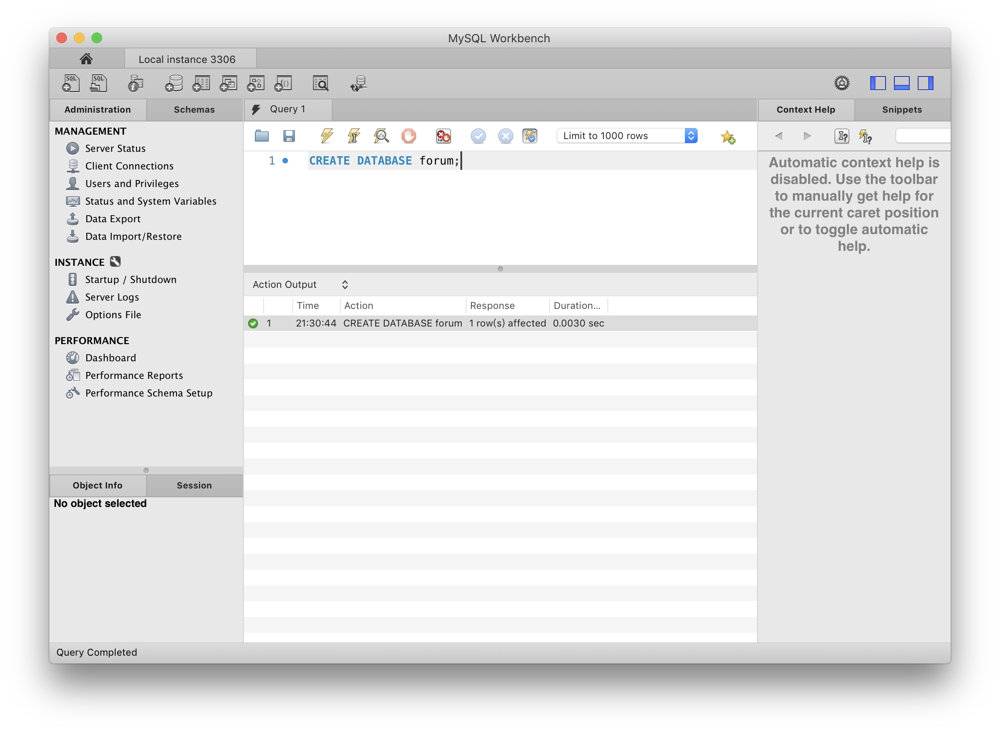

# 餐廳論壇

使用者能自行註冊帳號，並評論、喜愛、收藏最愛餐廳。以及追蹤其他使用者。

- 論壇首頁

  - 首頁可瀏覽瀏覽所有餐廳
  - 根據餐廳類別篩選
  - 「喜歡」餐廳、收藏最愛餐廳
  - 點擊餐廳名稱，進入個別餐廳描述頁

- 餐廳描述頁

  - 可點擊餐廳的名稱連結、『人氣餐廳』頁籤的『show』按鈕進入
  - 餐廳所屬類別、簡介、營業時間、電話、地址、所有評論
  - 點擊『Dashboard』按鈕瀏覽評論數量、瀏覽次數
  - 收藏、移除最愛該餐聽
  - 喜愛、不喜愛該餐廳
  - 刪除評論、評論該餐廳

- 最新動態

  - 瀏覽最近新增的 10 間餐廳名稱、類別、簡介
  - 瀏覽最近新增的 10 筆評論

- 人氣餐廳

  - 瀏覽最多使用者收藏到最愛的 10 間餐廳
  - 將人氣餐廳加到最愛餐廳或移除

- 美食達人

  - 瀏覽追蹤人數最多的 10 位使用者
  - 追蹤、取消追蹤使用者

- 使用者帳戶
  - 採用電子郵件進行註冊
  - 可變更頭像及名稱
  - 瀏覽所有正在追蹤的使用者、追蹤自己的使用者
  - 瀏覽使用者評論過的餐廳、收藏到最愛的餐廳

- 管理員後台
  - 餐廳：新增、移除、編輯餐廳各項資料
  - 餐廳類別：新增、編輯、移除餐廳類別
  - 使用者：切換一般使用者權限、管理員權限

&nbsp;

&nbsp;

## 1.設定開發環境

1. 建議將 Node.js 切換至 v14.16.0，較新版本可能無法執行

   ```code
   nvm install 14.16.0
   ```

   ```code
   nvm use 14.16.0
   ```

2. 安裝 Vue CLI

   ```code
   npm install -g vue-cli
   ```

## 2. 啟動後端 API 伺服器

1. 啟動 MySQL 資料庫

   1. 下載 [MySQL Community Server](https://downloads.mysql.com/archives/community/)（專案使用  v8.0.16／macOS 10.14／x86,64-bit, DMG Archive 版本）並安裝
   2. MySQL 會在安裝過程中的 Configuration 階段進行初始化設定
      1. 選擇密碼類型：選擇『Use Legacy Password Encryption』
      2. 設定 root 管理員密碼：  
         若僅作執行專案之用，建議先設為「password」
      3. 啟動 MySQL 資料庫：  
         開啟『系統偏好設定』，點擊『MySQL』圖示，點擊『Start MySQL Server』按鈕

2. 使用 MySQL Workbench 建立本地資料庫連線
   1. 下載 [MySQL Workbench](https://downloads.mysql.com/archives/workbench/) （專案使用 v8.0.16／macOS x86, 64-bit, DMG Archive 版本）並安裝
   2. 開啟 MySQL Workbench ，點擊 MySQL Connections 旁的『＋』按鈕，建立資料庫連線
   3. MySQL 連線設定
      | 設定欄位        | 設定值              |
      | :-------------- | :------------------ |
      | Connection Name | Local instance 3306 |
      | Hostname        | localhost           |
      | Port            | 3306                |
      | Username        | root                |
      | Password        | password            |

   4. 建立連線後，點擊『Local instance 3306』，輸入密碼「password」 啟動資料庫連線  
   輸入下方指令後，點擊上方『⚡︎Execute』（閃電符號）按鈕，建立名為「forum」的資料庫

      ```code
      CREATE DATABASE forum;
      ```

      

3. 啟動後端 API 伺服器
   1. 安裝後端 API 伺服器專案原始碼安裝至指定位置，你可以採取下列其中一種方法
      1. 到 [餐廳論壇 Express版本專案](https://github.com/ALPHACamp/forum-express) 頁面點選右上方綠色『Code』按鈕，選擇『Download ZIP』下載ZIP檔，並解壓縮至指定資料夾中

      2. 開啟『終端機 Terminal.app』  
       輸入指令，移動到指定資料夾位置  

        ```code
        cd 「後端專案資料夾路徑」 (資料夾名稱間的空格要用「 / 」隔開)
         ```

        輸入指令將後端專案 clone至指定資料夾

        ```code
        git clone https://github.com/ALPHACamp/forum-express.git
        ```

   2. 啟動後端 API 專案  

      - 開啟『終端機 Terminal.app』，移動到後端專案資料夾所在路徑  

      ```code
      cd 「後端專案資料夾路徑」 (資料夾名稱間的空格要用「 / 」隔開)
      ```

        - 依序輸入下列指令  

        安裝後端專案套件

      ```code
      npm install
      ```

      初始化資料庫

       ```code
      npx sequelize db:migrate
      ```

      建立種子資料

       ```code
      npx sequelize db:seed:all
      ```

       啟動後端 API 專案  

      ```code
      npm run dev
      ```

      - 當終端機顯示訊息 `Example app listening on port 3000` ，表示已成功啟動應用程式伺服器
      - 瀏覽網站時，要保持後端 API 伺服器運作，否則網站將無法讀取資料

## 3.啟動專案

### 另外開啟一個終端機視窗，並保持後端 API 伺服器持續執行中

1. 安裝專案原始碼安裝至指定位置，你可以採取下列其中一種方法
      1. 點選右上方綠色『Code』按鈕，選擇『Download ZIP』下載ZIP檔，並解壓縮至指定資料夾中

      2. 開啟『終端機 Terminal.app』  
       輸入指令，移動到指定資料夾位置  

      ```code
      cd 「後端專案資料夾路徑」 (資料夾名稱間的空格要用「 / 」隔開)
      ```

      輸入指令將後端專案 clone至指定資料夾

      ```code
      git clone https://github.com/Pudding1989/Restaurant-Forum-Vue.git
      ```

2. 安裝專案使用的套件

   ```code
    npm install
    ```

3. 輸入執行指令，啟動專案

- 當終端機顯示下列訊息，表示已成功開啟應用程式伺服器

  ```text
  App running at:
    - Local:   http://localhost:8080/
    - Network: http://192.168.0.1:8080/
  ```

## 4.測試帳號

### 擁有管理者權限測試帳號

帳號:

```text
root@example.com
```

密碼:

```text
12345678
```

## 5.開發工具

開發環境

- Node.js v14.16.0

前端框架

- Vue: 2.6.11
  - Vue CLI: 4.5.15
  - Vue Router: 3.2.0
  - Vuex: 3.4.0

前端套件

- Bootstrap: 4.4.1
  - jquery: 3.6.0
  - core-js: 3.6.5
  - popper: 1.16.1

- SweetAlert2: 11.4.0

其他套件

- Axios 0.26.0
- moment: 2.29.1
- uuid: 8.3.2
